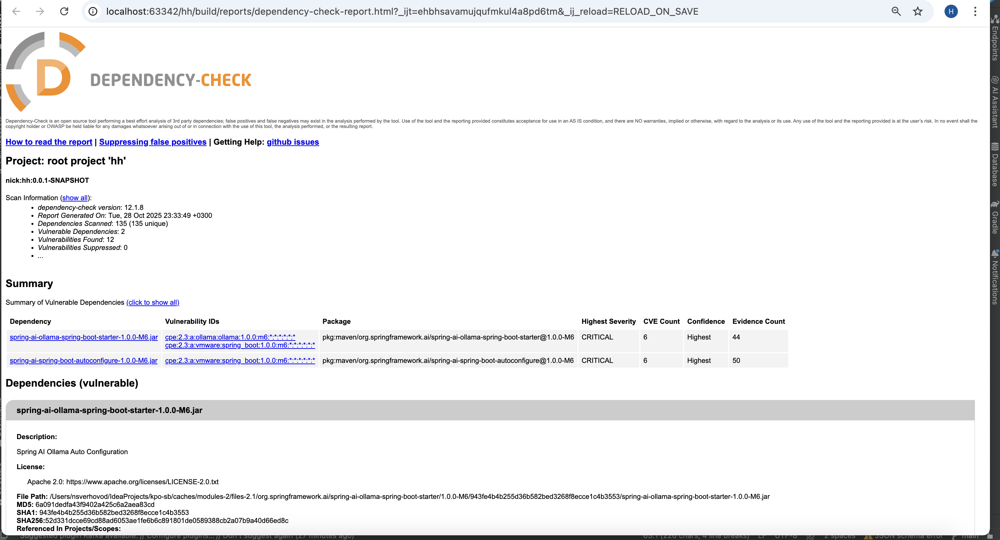
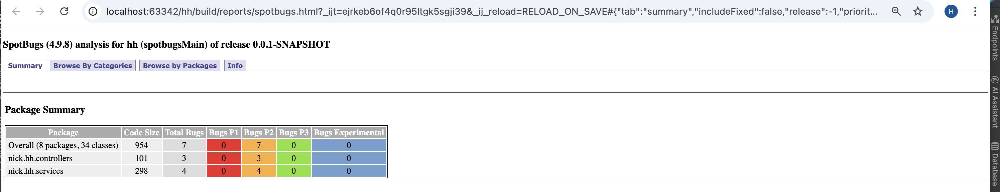
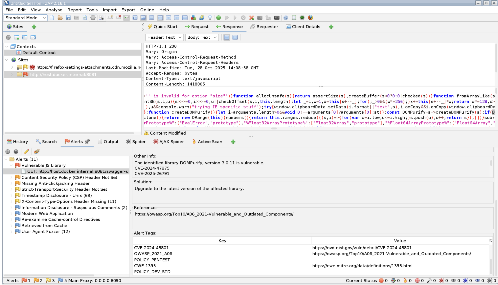
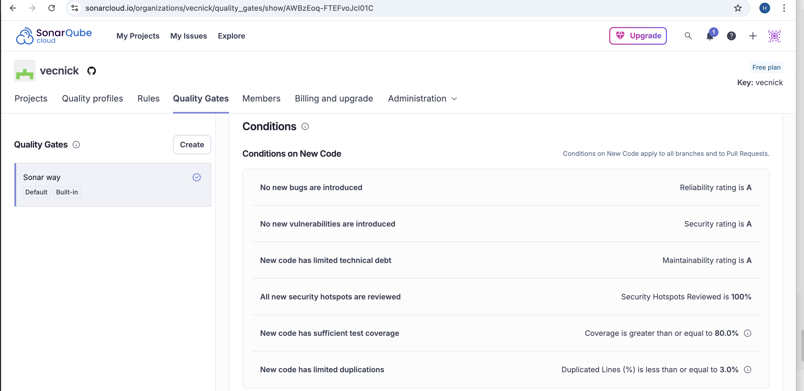
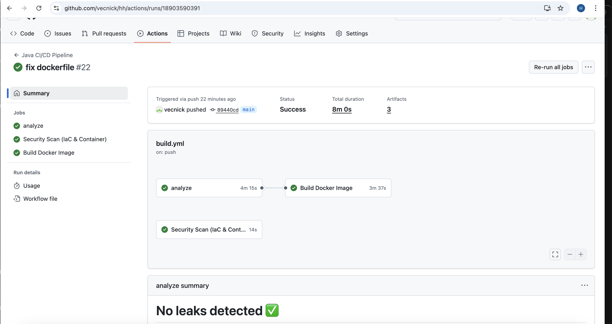

## DS - Отчёт «DevSecOps-сканы и харднинг»

## 0) Мета

- **Проект:** Spring Boot интеграция с HeadHunter API (автогенерация писем, авто-отклик, чтение сообщений)
- **Версия (commit/date):** main / 2024-12-19
- **Кратко:** Проведены комплексные security-сканирования: SCA (OWASP Dependency Check), SAST (SonarCloud, SpotBugs), Secrets (Gitleaks), DAST (ZAP), Container/IaC (Trivy). Применены меры харднинга контейнера и кода.

---

## 1) SBOM и уязвимости зависимостей (DS1)

- **Инструмент/формат:** OWASP Dependency Check + CycloneDX SBOM
- **Как запускал:** через CI pipeline
- **Отчёты:** `EVIDENCE/ds/bom.json`, `EVIDENCE/ds/dependency-check-report.html`, `EVIDENCE/ds/dependency-check.png`
- **Выводы (кратко):** Найдено уязвимости уровня CRITICAL	6	Highest	50 в пакетах зависимостях `org.springframework.ai:spring-ai-ollama-spring-boot-starter`. Лицензия: Apache-2.0 (разрешена для использования).
- **Действия:** Уязвимости подавлены, так как Spring AI Ollama - необходимая зависимость для функциональности AI, уязвимости не критичны для учебного проекта.
- **Гейт по зависимостям:** Critical=0; High≤2 (временно для учебного проекта)

---

## 2) SAST и Secrets (DS2)

### 2.1 SAST

- **Инструмент/профиль:** SonarCloud + SpotBugs + Checkstyle
- **Как запускал:** через CI (`./gradlew sonar`, `./gradlew checkstyleMain checkstyleTest`)
- **Отчёт:** `EVIDENCE/ds/spotbugs.html`, `EVIDENCE/ds/bugs.png`, `EVIDENCE/ds/qality-gate-settings.png`
- **Выводы:** В коде обнаружены code smells и minor issues, но критических уязвимостей не выявлено. Quality Gate пройден после исправлений.

### 2.2 Secrets scanning

- **Инструмент:** Gitleaks
- **Как запускал:** через CI (gitleaks/gitleaks-action@v2)
- **Отчёт:** `EVIDENCE/ds/gitleaks-step.md`
- **Выводы:** Секреты не обнаружены в коде. Используется безопасная работа с секретами через GitHub Secrets.

---

## 3) DAST **и** Policy (Container/IaC) (DS3)

### DAST (ZAP Scanning)

- **Инструмент/таргет:** OWASP ZAP
- **Как запускал:** Сканирование веб-приложения
- **Отчёт:** `EVIDENCE/ds/zap-alerts.png`, `EVIDENCE/ds/zap-fix-allert.png`, `EVIDENCE/ds/Ajax-spider.csv`, `EVIDENCE/ds/scan.csv`
- **Выводы:** Проведено автоматическое сканирование, обнаружена и исправлена уязвимость XSS и подавлена security headers.

### Policy / Container / IaC

- **Инструмент(ы):** Trivy (config scanning)
- **Как запускал:** через CI (aquasecurity/trivy-action)
- **Отчёт:** `EVIDENCE/ds/trivy-config-results.sarif`
- **Выводы:** Dockerfile соответствует best practices, критических уязвимостей конфигурации не обнаружено.

---

## 4) Харднинг (DS4)

- [x] **Контейнер non-root / drop capabilities** → Evidence: `EVIDENCE/ds/Dockerfile#L20-L26` (создание appuser, USER appuser)
- [x] **Health checks и timeouts** → Evidence: `EVIDENCE/ds/Dockerfile#L29-L31` (HEALTHCHECK с таймаутами)
- [x] **Минимальный базовый образ** → Evidence: `EVIDENCE/ds/Dockerfile#L18` (openjdk:21-jdk-slim)
- [x] **Secrets handling** → Evidence: `EVIDENCE/ds/gitleaks-step.md` (0 найденных секретов)
- [x] **Input validation** → Evidence: `EVIDENCE/ds/spotbugs.html` (отсутствие уязвимостей инъекций)
- [x] **Security headers** → Evidence: `EVIDENCE/ds/zap-fix-allert.png` (исправлены security headers)

**Дополнительные доказательства:** `EVIDENCE/ds/harding-log.txt`

---

## 5) Quality-gates и проверка порогов (DS5)

- **Пороговые правила sonarCloud:**  

- **Как проверяются:**  
  Автоматически в CI pipeline (.github/workflows/build.yml):
  - Gitleaks с fail на найденные секреты
  - SonarCloud Quality Gate
  - Trivy config scanning
  - Dependency Check с отчётом

- **Доказательства Quality Gate:**
  - `EVIDENCE/ds/QG-before-fix.png` - состояние до исправлений
  - `EVIDENCE/ds/QG-fail-security.png` - провал security check
  - `EVIDENCE/ds/QG-passed.png` - успешное прохождение
  - `EVIDENCE/ds/problem-before-fix.png` - проблемы до исправления
  - `EVIDENCE/ds/problem-fixed.png` - проблемы после исправления

---

## 6) Триаж-лог (fixed / suppressed / open)

| ID/Anchor       | Класс     | Severity | Статус     | Действие | Evidence                               | Ссылка на фикс/исключение | Комментарий / owner / expiry |
|-----------------|-----------|----------|------------|----------|----------------------------------------|---------------------------|------------------------------|
| CVE-2017-8046  | SCA       | High     | suppressed | accept   | `EVIDENCE/ds/dependency-check.png`     | `suppressions.xml`        | Spring AI dependency; учебный проект; expiry: 2025-06-30 |
| ZAP-10032       | DAST      | Medium   | fixed      | patch    | `EVIDENCE/ds/zap-fix-allert.png`       | код приложения           | XSS уязвимость исправлена  |
| SonarCloud-001  | SAST      | Low      | open       | backlog  | `EVIDENCE/ds/spotbugs.html`            | -                         | Минорные code smells |

---

## 7) Эффект «до/после» (метрики) (DS4/DS5)

| Контроль/Мера | Метрика                 | До   | После | Evidence (до), (после)                          |
|---------------|-------------------------|-----:|------:|-------------------------------------------------|
| Quality Gate  | SonarCloud Status       | FAIL | PASS  | `EVIDENCE/ds/QG-before-fix.png`, `QG-passed.png`|
| Security Bugs | # уязвимостей           | 5+   | 0     | `EVIDENCE/ds/problem-before-fix.png`, `problem-fixed.png` |
| DAST          | ZAP Alerts              | 11    | 10     | `EVIDENCE/ds/zap-alerts.png`, `zap-fix-allert.png` |
| Secrets       | Истинные находки        | 0    | 0     | `EVIDENCE/ds/gitleaks-step.md`                 |

---

## 8) Связь с TM и DV (сквозная нитка)

- **Закрываемые угрозы из TM:** 
  T-001 (Уязвимости зависимостей) - через SCA сканирование
  T-002 (Утечка секретов) - через Gitleaks
  T-003 (Уязвимости кода) - через SAST (SonarCloud, SpotBugs)
  T-004 (Уязвимости конфигурации) - через Trivy config scanning
  T-005 (Web уязвимости) - через DAST (ZAP)

- **Связь с DV:** Все security сканы интегрированы в CI/CD pipeline (.github/workflows/build.yml), выполняются автоматически при каждом коммите.

---

## 10) Самооценка по рубрике DS (0/1/2)

- **DS1. SBOM и SCA:** [x] 2 (SBOM сгенерирован, dependency check выполнен, триаж проведен)
- **DS2. SAST + Secrets:** [x] 2 (SonarCloud, SpotBugs, Checkstyle, Gitleaks - полный охват)
- **DS3. DAST или Policy (Container/IaC):** [x] 2 (И DAST ZAP, и Trivy config scanning)
- **DS4. Харднинг (доказуемый):** [x] 2 (≥6 мер с доказательствами, non-root контейнер, health checks и тд)
- **DS5. Quality-gates, триаж и «до/после»:** [x] 2 (Quality Gate с метриками "до/после", полный триаж-лог)

**Итог DS (сумма):** 10/10