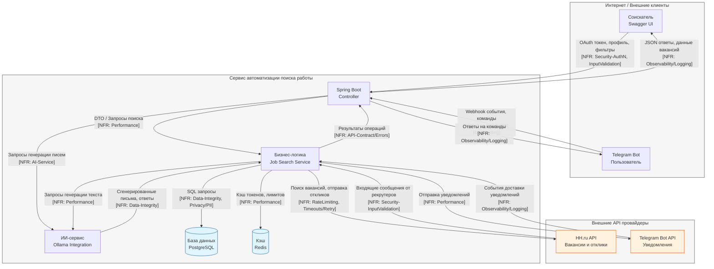

# TM - Требования безопасности + Модель угроз + ADR

## 0) Мета

- **Проект:** Система автоматизации поиска работы - https://github.com/vecnick/hh
- **Версия:** commit/2025-10-13
- **Кратко:** Веб-приложение для автоматизации поиска работы, интегрирующееся с HH.ru API и Telegram для массовых откликов, генерации сопроводительных писем и управления коммуникацией с рекрутерами.

---

## 1) Архитектура и границы доверия (TM1, S04)

- **Роли/активы:** Соискатель (пользователь), данные резюме (PII), OAuth токены HH.ru, история откликов
- **Зоны доверия:** Internet / Service Layer / External APIs
- **Context/DFD:**

- **Критичные интерфейсы и допущения:**
  - Internet ↔ Service: публичный API через Swagger UI, требует строгой аутентификации
  - Service ↔ External: интеграции с HH.ru и Telegram API, требуют rate limiting и обработки сбоев
  - Service ↔ Storage: внутреннее хранение данных, требует шифрования PII
  - Допущение: HH.ru API является доверенным источником вакансий и сообщений

---

## 2) Реестр угроз STRIDE (TM2, TM3, S04)

| ID  | STRIDE | Компонент/поток | Угроза (кратко) | L | I | L×I |
|-----|--------|------------------|-----------------|---|---|-----|
| T01 | **S**  | Edge: Internet → Controller | Подмена OAuth токена при авторизации через HH.ru | 4 | 5 | 20 |
| T02 | **D**  | Edge: Business Logic → HH.ru API | Блокировка аккаунта из-за превышения лимитов API | 4 | 4 | 16 |
| T03 | **I**  | Node: PostgreSQL | Несанкционированный доступ к PII данным пользователей | 3 | 5 | 15 |
| T04 | **D**  | Edge: Business Logic → External APIs | Недоступность внешних API (HH.ru, Telegram) | 3 | 4 | 12 |
| T05 | **E**  | Node: Business Logic | Обход проверок прав доступа к данным других пользователей | 3 | 4 | 12 |
| T06 | **D**  | Edge: Internet → Controller | DoS через массовые запросы к API | 4 | 3 | 12 |
| T07 | **T**  | Edge: Business Logic → PostgreSQL | SQL инъекции через уязвимости в ORM/запросах | 2 | 5 | 10 |
| T08 | **I**  | Node: Ollama Integration | Утечка PII через ИИ-модель в логах | 3 | 3 | 9 |
| T09 | **S**  | Edge: Telegram Bot API → Business Logic | Подмена webhook событий от Telegram | 3 | 3 | 9 |
| T10 | **D**  | Node: Redis | Исчерпание памяти через атаку на кэш | 2 | 4 | 8 |

**Доменно-специфичные угрозы:**
- T11: **I** - Утечка стратегии поиска работы конкурентам через аналитику
- T12: **T** - Подмена сгенерированных ИИ писем для создания негативного впечатления
- T13: **R** - Отрицание отправки некорректных автоответов рекрутерам

---

## 3) Приоритизация и Top-5 _(TM3, S04)_

1) **T01 Подмена OAuth токена** - L×I=20; подмена аккаунта пользователя, либо внедрение посредника, доступ к PII
2) **T02 Блокировка аккаунта HH.ru** - L×I=16; потеря основного функционала системы, высокий риск при автоматизации
3) **T03 Доступ к PII данным** - L×I=15; массовая утечка персональных данных, GDPR нарушения
4) **T04 Недоступность внешних API** - L×I=12; критичный функционал становится недоступным, зависимость от внешних сервисов
5) **T05 Обход проверок прав доступа** - L×I=12; доступ к конфиденциальным данным других пользователей

**Факторы приоритизации:**
- T01: Высокая экспозиция (публичный эндпоинт) + критичное воздействие (полный доступ)
- T02: Высокая вероятность (автоматические запросы) + значительное воздействие (блокировка основного функционала)
- T03: Умеренная вероятность + критичное воздействие (GDPR нарушения)

---

## 4) Требования (S03) и ADR-решения (S05) под Top-5 (TM4)

### NFR-005 - Безопасность аутентификации OAuth

- **AC (GWT):**
  - **Given** истёкший access token, **When** POST `/api/hh/auto-apply`, **Then** `401` с RFC7807 и событие `auth.token_expired`
  - **Given** валидный OAuth flow с PKCE, **When** авторизация через HH.ru, **Then** успешный обмен кода на токен

### NFR-002 - Управление лимитами API

- **AC (GWT):** 
  - **Given** приближение к лимитам HH.ru API, **When** отправка откликов, **Then** автоматическое регулирование частоты или постановка в очередь
  - **Given** превышение лимитов, **When** вызов HH.ru API, **Then** `429` с `Retry-After` и событие `rate_limit_exceeded`

### NFR-006 - Защита PII данных

- **AC (GWT):**
  - **Given** PII данные пользователя, **When** сохранение в БД, **Then** шифрование полей AES-256
  - **Given** логи приложения, **When** запись PII полей, **Then** автоматическое маскирование

### NFR-008 - Устойчивость внешних API

- **AC (GWT):**
  - **Given** недоступность HH.ru API, **When** вызов поиска вакансий, **Then** circuit breaker активируется после 3 неудачных попыток
  - **Given** сбой внешнего API, **When** критичная операция, **Then** graceful degradation с уведомлением пользователя

### NFR-011 - Circuit Breaker для внешних API

- **AC (GWT):**
  - **Given** 50% ошибок за 1 минуту в HH.ru API, **When** вызовы API, **Then** circuit breaker открывается на 30 секунд
  - **Given** открытый circuit breaker, **When** проходит 30 секунд, **Then** выполняется пробный запрос для проверки восстановления

### NFR-012 - Strict RBAC контроль доступа

- **AC (GWT):**
  - **Given** пользователь A пытается получить доступ к данным пользователя B, **When** выполняется запрос, **Then** возвращается 404 без утечки информации
  - **Given** любая операция с данными, **When** выполнение, **Then** проходит проверки владения на Controller, Service и DAO уровнях

---

### Краткие ADR (архитектурные решения S05)

#### ADR-001 - OAuth 2.1 PKCE Implementation

- **Context (угрозы/NFR):** T01, NFR-005; контур аутентификации
- **Decision:** Реализация OAuth 2.1 с PKCE, TTL access token = 15 мин, обязательная валидация state параметра
- **Trade-offs:** Усложнение flow аутентификации, требует изменения клиентской логики
- **DoD:** 100% успешных аутентификаций используют PKCE, отсутствие передачи code_verifier в redirect URI
- **Owner:** Security Team
- **Evidence:** EVIDENCE/oauth-pkce-implementation.md

#### ADR-002 - External API Resilience Pattern

- **Context:** T02, T04; NFR-002, NFR-008, NFR-011; интеграция с внешними API
- **Decision:** Circuit breaker + retry с джиттером + кэширование, adaptive rate limiting, graceful degradation
- **Trade-offs:** Усложнение архитектуры, возможные задержки при обработке
- **DoD:** Circuit breaker корректно открывается/закрывается, время восстановления API ≤ 5 минут
- **Owner:** Backend Team
- **Evidence:** EVIDENCE/api-resilience-implementation.md

#### ADR-003 - Application-Level PII Encryption

- **Context:** T03, NFR-006; хранение данных в PostgreSQL
- **Decision:** Шифрование PII на уровне приложения (AES-256-GCM), маскирование в логах, ключи из HashiCorp Vault
- **Trade-offs:** Усложнение запросов к данным, производительность при шифровании/дешифровании
- **DoD:** Зашифрованные данные в БД не читаемы без ключа, отсутствие чистого PII в логах
- **Owner:** Security Team
- **Evidence:** EVIDENCE/pii-encryption-implementation.md

#### ADR-004 - External API Resilience Pattern

- **Context:** T02; NFR-008, NFR-011; интеграция с внешними API
- **Decision:** Circuit breaker + retry с джиттером + кэширование, adaptive rate limiting, graceful degradation
- **Trade-offs:** Усложнение архитектуры, возможные задержки при обработке
- **DoD:** Circuit breaker корректно открывается/закрывается, время восстановления API ≤ 5 минут
- **Owner:** Backend Team
- **Evidence:** EVIDENCE/api-resilience-implementation.md

#### ADR-005 - Strict RBAC Implementation

- **Context:** T05, NFR-012; бизнес-логика приложения
- **Decision:** Strict RBAC с проверками владения на всех уровнях, единообразные ошибки 404 для несанкционированного доступа
- **Trade-offs:** Усложнение кодовой базы, требует строгой дисциплины разработки
- **DoD:** 100% операций с данными проходят проверки владения, penetration testing не выявляет уязвимостей обхода RBAC
- **Owner:** Security Team
- **Evidence:** EVIDENCE/rbac-implementation.md

---

## 5) Трассировка Threat → NFR → ADR → (План)Проверки (TM5)

| Threat | NFR | ADR | Чем проверяем (план/факт) |
|--------|-----|-----|---------------------------|
| T01 | NFR-005 | ADR-001 | DAST тесты OAuth flow → EVIDENCE/dast-oauth-test.pdf Аудит событий аутентификации → EVIDENCE/auth-audit-sample.txt |
| T02 | NFR-002 | ADR-002 | Нагрузочное тестирование rate limiting → EVIDENCE/load-test-results.md Мониторинг 429 ошибок → EVIDENCE/rate-limit-monitoring.png |
| T03 | NFR-006 | ADR-003 | Сканирование БД на наличие незашифрованного PII → EVIDENCE/db-scan-report.md Анализ логов на утечки PII → EVIDENCE/log-analysis-report.txt |
| T04 | NFR-008, NFR-011 | ADR-004 | Тестирование circuit breaker → EVIDENCE/circuit-breaker-tests.md Мониторинг доступности внешних API → EVIDENCE/api-availability.png |
| T05 | NFR-012 | ADR-005 | Penetration testing RBAC → EVIDENCE/rbac-penetration-test.md Аудит операций доступа → EVIDENCE/access-audit-sample.txt |

---

## 6) План проверок (мост в DV/DS)

- **SAST/Secrets/SCA:** SonarQube + GitLeaks, отчёты в `EVIDENCE/sast-report-YYYY-MM-DD.pdf`
- **SBOM:** CycloneDX через OWASP Dependency Track, файлы в `EVIDENCE/sbom/`
- **DAST:** OWASP ZAP против тестового стенда, отчёты в `EVIDENCE/dast-report-YYYY-MM-DD.pdf`
- **Нагрузочное тестирование:** Jmeter для тестирования rate limiting и производительности, отчёты в `EVIDENCE/load-test-YYYY-MM-DD.md`
- **Пентест:** Ручное тестирование безопасности OAuth flow и контроля доступа
- **Аудит безопасности:** Регулярный аудит конфигураций и проверка соответствия политикам

---

## 7) Самопроверка по рубрике TM (0/1/2)

- **TM1. Архитектура и границы доверия:** [x] 2 (Полная DFD с явными границами доверия, ролями и критичными интерфейсами)
- **TM2. Покрытие STRIDE и уместность угроз:** [x] 2 (Все буквы STRIDE покрыты, добавлены доменно-специфичные угрозы)
- **TM3. Приоритизация и Top-5:** [x] 2 (Четкая приоритизация с обоснованием, учтены дополнительные факторы)
- **TM4. NFR + ADR под Top-5:** [x] 2 (5 ADR с четкими DoD, полное покрытие Top-5 рисков)
- **TM5. Трассировка → (план)проверок:** [x] 2 (Полная трассировка с конкретными планами проверок для всех Top-5 рисков)

**Итог TM (сумма):** 10/10
