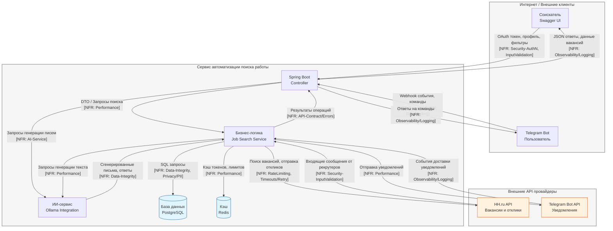

# DFD для системы автоматизации поиска работы

## Контекстная диаграмма системы

```mermaid
flowchart TD
    %% --- Trust boundaries (по контурам) ---
    subgraph Internet[Интернет / Внешние клиенты]
        U[Соискатель<br/>Swagger UI]
        T[Telegram Bot<br/>Пользователь]
    end

    subgraph Service[Сервис автоматизации поиска работы]
        A[Spring Boot<br/>Controller]
        S[Бизнес-логика<br/>Job Search Service]
        AI[ИИ-сервис<br/>Ollama Integration]
        D[(База данных<br/>PostgreSQL)]
        C[(Кэш<br/>Redis)]
    end

    subgraph External[Внешние API провайдеры]
        H[HH.ru API<br/>Вакансии и отклики]
        TG[Telegram Bot API<br/>Уведомления]
    end

    %% --- Основные потоки данных ---
    U -- "OAuth токен, профиль, фильтры<br/>[NFR: Security-AuthN, InputValidation]" --> A
    T -- "Webhook события, команды<br/>[NFR: Security-AuthN, RateLimiting]" --> A
    
    A -->|"DTO / Запросы поиска<br/>[NFR: Performance]"| S
    A -->|"Запросы генерации писем<br/>[NFR: AI-Service]"| AI
    
    S -->|"SQL запросы<br/>[NFR: Data-Integrity, Privacy/PII]"| D
    S -->|"Кэш токенов, лимитов<br/>[NFR: Performance]"| C
    S -->|"Запросы генерации текста<br/>[NFR: Performance]"| AI
    
    S -->|"Поиск вакансий, отправка откликов<br/>[NFR: RateLimiting, Timeouts/Retry]"| H
    S -->|"Отправка уведомлений<br/>[NFR: Performance]"| TG
    
    AI -->|"Сгенерированные письма, ответы<br/>[NFR: Data-Integrity]"| S
    S -->|"Результаты операций<br/>[NFR: API-Contract/Errors]"| A
    
    A -->|"JSON ответы, данные вакансий<br/>[NFR: Observability/Logging]"| U
    A -->|"Ответы на команды<br/>[NFR: Observability/Logging]"| T

    %% --- Обратные потоки от внешних API ---
    H -- "Входящие сообщения от рекрутеров<br/>[NFR: Security-InputValidation]" --> S
    TG -- "События доставки уведомлений<br/>[NFR: Observability/Logging]" --> S

    %% --- Оформление границ ---
    classDef boundary fill:#f6f6f6,stroke:#999,stroke-width:2px;
    classDef storage fill:#e1f5fe,stroke:#01579b;
    classDef external fill:#fff3e0,stroke:#e65100;
    class Internet,Service,External boundary;
    class D,C storage;
    class H,TG external;
```
